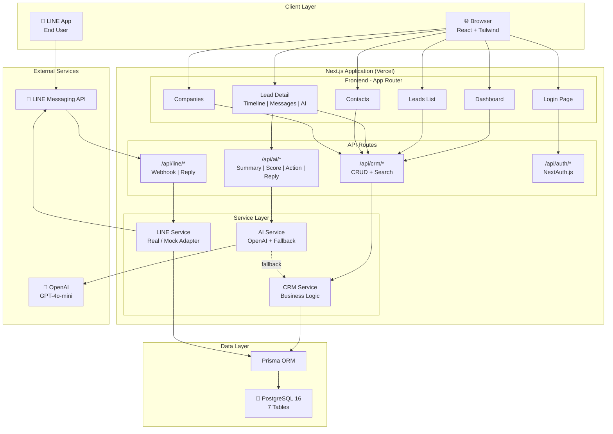
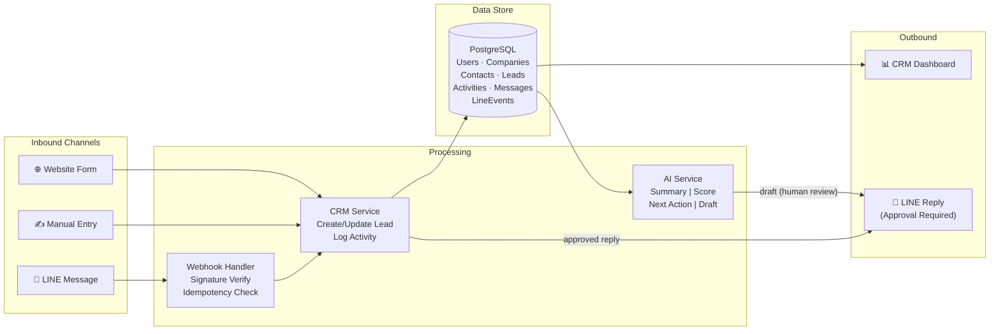
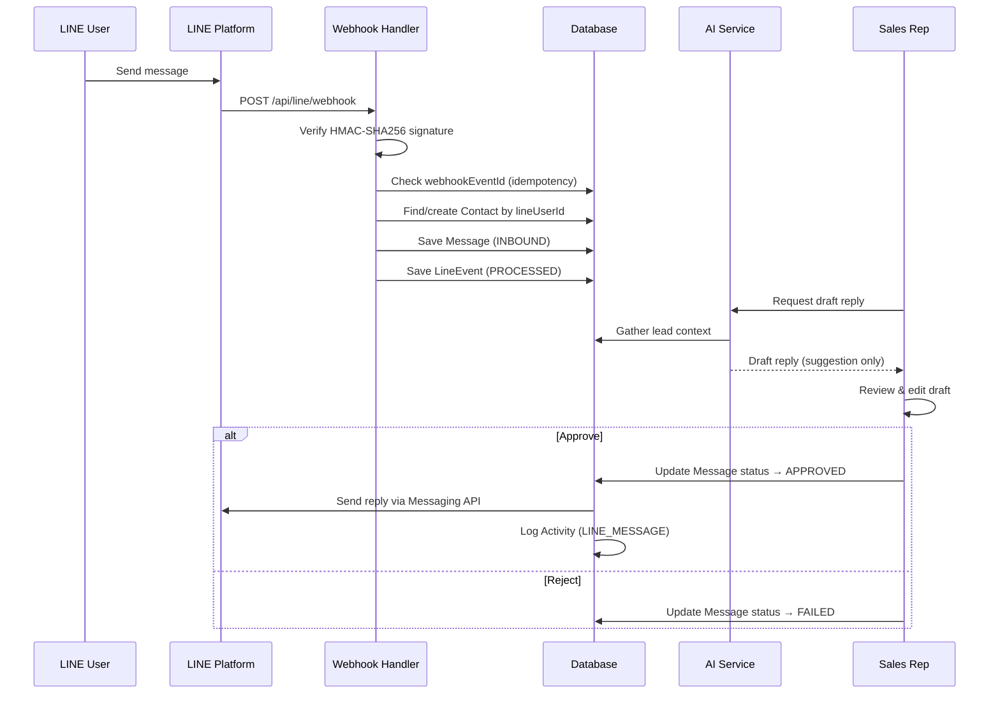

# AI CRM MVP — Jenosize

An AI-powered CRM system for sales teams with LINE OA integration, built as a test assignment for the Lead AI Software Engineer position at Jenosize.

## 📖 Documentation

| Document | Description |
|----------|-------------|
| [🚀 Deployment Guide](docs/DEPLOYMENT.md) | การติดตั้ง, Production deploy, LINE OA, Cloudflare Tunnel |
| [📖 User Manual](docs/USER_MANUAL.md) | คู่มือการใช้งานระบบอย่างละเอียด (ภาษาไทย) |

## 🚀 Quick Start

### Prerequisites
- Node.js 18+
- PostgreSQL database (or Supabase free tier)
- (Optional) OpenAI API key
- (Optional) LINE Official Account

### 1. Clone & Install
```bash
git clone <repository-url>
cd ai-crm-mvp
npm install
cd backend && npm install && cd ..
```

### 2. Environment Setup
```bash
cp .env.example .env.local
cp backend/.env.example backend/.env

# Frontend: set NEXT_PUBLIC_API_URL (for example, http://localhost:4000)
# Backend: set DATABASE_URL, JWT_SECRET, FRONTEND_URL, TRUST_PROXY_HOPS, and provider credentials
```

### 3. Database Setup
```bash
# Option A: Apply versioned migrations from the project root (recommended for production)
npx prisma migrate deploy

# Option B: Push schema directly (quick setup for development)
npm run db:push

# Seed with synthetic data
npm run db:seed
```

### 4. Run Development Servers
```bash
# Terminal 1 — frontend
npm run dev
# Open http://localhost:3000

# Terminal 2 — backend
cd backend
npm run dev
# API runs at http://localhost:4000 and loads backend/.env automatically
```

### RBAC Permission Matrix
| Action | Admin | Manager | Sales |
|--------|-------|---------|-------|
| View all leads | ✅ | ✅ | ❌ own only |
| Create lead | ✅ | ✅ | ✅ |
| Edit lead | ✅ | ✅ | ✅ own only |
| Delete lead/contact/company | ✅ | ❌ | ❌ |
| Manage users (create/disable/delete) | ✅ | ❌ | ❌ |
| Dashboard (all data) | ✅ | ✅ | ❌ own leads only |
| AI copilot | ✅ | ✅ | ✅ |
| LINE integration | ✅ | ✅ | ✅ |

---

## 🏗 Architecture

### Tech Stack
| Layer | Technology |
|-------|-----------|
| Frontend | Next.js 16 (App Router), React 19, TypeScript |
| Styling | Tailwind CSS v4, Custom dark design system |
| Backend | Express.js + TypeScript (standalone, port 4000) |
| Database | PostgreSQL 16 + Prisma ORM |
| AI | Multi-provider: OpenAI / Gemini Gateway / Heuristic Fallback |
| LINE | LINE Messaging API (Real + Mock adapter) |
| Auth | JWT (stateless, bcrypt password hash) |
| Security | Rate limiting (express-rate-limit), RBAC (3 roles) |
| Attachments | Authenticated upload/download, local filesystem metadata in PostgreSQL |
| Audit | Comprehensive audit log (login/logout, CRUD, exports) |
| CI/CD | GitHub Actions (lint + test + build on every push/PR) |
| Tunnel | Cloudflare Tunnel (ai-crm / ai-crm-api subdomains) |

### System Architecture



### Data Flow Diagram



### LINE Reply Flow (Human-in-the-Loop)



### Key Design Decisions
1. **Next.js monolith** over separate backend — reduces deployment complexity for MVP
2. **AI suggestions ≠ confirmed actions** — human-in-the-loop for all AI outputs
3. **LINE reply requires approval** — draft → approve → send flow with audit trail
4. **Idempotent webhook processing** — LineEvent table prevents duplicate processing
5. **Graceful AI fallback** — rule-based heuristics when OpenAI is unavailable

---

## 📡 API Reference

Backend runs on `http://localhost:4000`. All `/api/crm/*` and `/api/ai/*` routes require `Authorization: Bearer <token>`.

Login attempts are rate-limited independently. Authenticated `/api/auth/me` and `/api/auth/logout` requests do not consume the login-attempt quota.

### Reverse Proxy Configuration

`TRUST_PROXY_HOPS` must match the production network path so Express and the rate limiter derive the correct client IP. The secure default is `0`.

| Deployment path | Value |
|-----------------|-------|
| Client → Express directly | `TRUST_PROXY_HOPS=0` |
| Client → Nginx or Cloudflare Tunnel → Express | `TRUST_PROXY_HOPS=1` |
| Client → CDN → load balancer → Express | Set the exact verified proxy-hop count |

Do not set a non-zero value when Express is directly internet-facing: clients could spoof forwarded IP headers and bypass per-IP rate limits. If production has routes with different proxy-chain lengths, configure trusted proxy IP ranges instead of a numeric hop count.

### Auth (`/api/auth`)

| Method | Path | Auth | Description |
|--------|------|------|-------------|
| POST | `/api/auth/login` | No | Login with email/password → returns JWT token |
| GET | `/api/auth/me` | Yes | Get current user info from token |

### CRM (`/api/crm`) — All require auth

| Method | Path | Description |
|--------|------|-------------|
| GET | `/api/crm/dashboard` | Dashboard stats (counts, pipeline, recent activity) |
| GET | `/api/crm/search?q=` | Global search across leads, contacts, companies |
| **Leads** | | |
| GET | `/api/crm/leads?page=&stage=&source=&search=` | List leads with pagination + filters |
| GET | `/api/crm/leads/:id` | Lead detail with relations (company, contact, activities, messages) |
| POST | `/api/crm/leads` | Create lead `{ title, ownerId, companyId?, contactId?, value?, source? }` |
| PUT | `/api/crm/leads/:id` | Update lead fields (including stage transitions) |
| DELETE | `/api/crm/leads/:id` | Delete lead (cascades activities/attachments) |
| GET | `/api/crm/leads/:id/activities` | List activities for a lead |
| POST | `/api/crm/leads/:id/activities` | Add activity `{ type, description }` |
| GET | `/api/crm/leads/:id/messages` | List messages for a lead |
| GET | `/api/crm/leads/:id/attachments` | List attachments for a lead |
| POST | `/api/crm/leads/:id/attachments` | Upload file (multipart, 20MB max) |
| GET | `/api/crm/attachments/:id/download` | Download attachment using the Bearer token header |
| DELETE | `/api/crm/attachments/:id` | Delete attachment |
| **Contacts** | | |
| GET | `/api/crm/contacts?page=&search=` | List contacts with pagination |
| GET | `/api/crm/contacts/:id` | Contact detail with company, leads, messages |
| POST | `/api/crm/contacts` | Create contact `{ firstName, lastName, email?, phone?, companyId? }` |
| PUT | `/api/crm/contacts/:id` | Update contact fields |
| DELETE | `/api/crm/contacts/:id` | Delete contact |
| GET | `/api/crm/contacts/:id/messages` | List messages for a contact |
| POST | `/api/crm/contacts/:id/create-lead` | Create lead directly from contact |
| **Companies** | | |
| GET | `/api/crm/companies?page=&search=` | List companies with pagination |
| GET | `/api/crm/companies/:id` | Company detail with contacts, leads |
| POST | `/api/crm/companies` | Create company `{ name, industry?, website? }` |
| PUT | `/api/crm/companies/:id` | Update company fields |
| DELETE | `/api/crm/companies/:id` | Delete company |
| **Tasks** | | |
| GET | `/api/crm/tasks?leadId=&status=` | List tasks with filters |
| POST | `/api/crm/tasks` | Create task `{ title, leadId?, assigneeId, priority?, dueDate? }` |
| PUT | `/api/crm/tasks/:id` | Update task (status, title, etc.) |
| DELETE | `/api/crm/tasks/:id` | Delete task |

### AI (`/api/ai`) — All require auth

| Method | Path | Body | Description |
|--------|------|------|-------------|
| POST | `/api/ai/summarize` | `{ leadId }` | Generate AI lead summary (with fallback) |
| POST | `/api/ai/score` | `{ leadId }` | Generate qualification score 0-100 (with fallback) |
| POST | `/api/ai/next-action` | `{ leadId }` | Suggest next best action (with fallback) |
| POST | `/api/ai/draft-reply` | `{ leadId }` | Generate draft LINE reply (with fallback) |

### LINE (`/api/line`)

| Method | Path | Auth | Description |
|--------|------|------|-------------|
| POST | `/api/line/webhook` | LINE signature | Receive LINE webhook events (HMAC-SHA256 verified) |
| GET | `/api/line/webhook` | No | Health check for LINE webhook |
| POST | `/api/line/draft` | Yes | Create outbound draft message for a lead |
| POST | `/api/line/reply` | Yes | Approve/edit/reject a draft message `{ messageId, action }` |
| POST | `/api/line/push` | Yes | Push message directly to a LINE contact |

### Users (`/api/users`) — ADMIN only

| Method | Path | Description |
|--------|------|-------------|
| GET | `/api/users` | List all users with stats |
| POST | `/api/users` | Create user `{ email, name, password, role? }` |
| PUT | `/api/users/:id` | Update user name/role/password |
| PUT | `/api/users/:id/toggle-active` | Enable/disable user (cannot self-disable) |
| DELETE | `/api/users/:id` | Delete user (cannot self-delete, must reassign leads first) |

### Audit Log (`/api/audit`) — ADMIN only

| Method | Path | Description |
|--------|------|-------------|
| GET | `/api/audit` | Query audit logs with filters `?entity=LEAD&action=CREATE&page=1&limit=50` |

### Data Export (`/api/export`) — Auth required

| Method | Path | Description |
|--------|------|-------------|
| GET | `/api/export/leads` | Export leads as CSV (SALES: own leads only) |
| GET | `/api/export/contacts` | Export all contacts as CSV |

### Common Response Formats

**Success**: `{ data: ..., total?, page?, totalPages? }`

**Error**: `{ error: "message" }` with appropriate HTTP status code

**AI Response**: `{ success: true, data: { ... }, fallback?: true }` — `fallback: true` indicates heuristic response

---

## 🧪 Testing

```bash
# Run all tests
npm test

# Watch mode
npm run test:watch
```

### Test Coverage
- `tests/crm.test.ts` — Core CRM CRUD, stage transitions, search
- `tests/ai-skill.test.ts` — AI behaviors, fallback when API unavailable
- `tests/line-webhook.test.ts` — Webhook signature verification, idempotency

---

## 🤖 AI CRM Copilot

See [`skills/crm-copilot/SKILL.md`](skills/crm-copilot/SKILL.md) for the full skill definition.

### Features
1. **Lead Summary** — AI-generated overview with key points and sentiment
2. **Qualification Score** — 0-100 score with breakdown reasons
3. **Next Best Action** — Prioritized recommendation with timeline
4. **Draft LINE Reply** — Context-aware message draft requiring approval

### Guardrails
- AI outputs are labeled as suggestions, never auto-executed
- LINE replies require human approval before sending
- Fallback to rule-based logic when OpenAI is unavailable
- All AI actions logged in activity timeline

---

## 💬 LINE OA Integration

### Setup
1. Create a LINE Official Account at https://developers.line.biz
2. Enable Messaging API
3. Set webhook URL: `https://your-domain.com/api/line/webhook`
4. Copy Channel ID, Secret, and Access Token to `.env.local`

### Features
- Webhook signature verification (HMAC-SHA256)
- Inbound message capture and contact mapping
- Approval-based reply flow
- Idempotent event processing (retry-safe)
- Mock adapter for local testing (`LINE_USE_MOCK=true`)

---

## 📦 Deployment

### Vercel + Supabase
```bash
# 1. Create Supabase project (free tier)
# 2. Copy DATABASE_URL from Supabase dashboard

# 3. Deploy to Vercel
npx vercel

# 4. Set environment variables in Vercel dashboard
# 5. Run migrations
npx vercel env pull .env.local
npm run db:push
npm run db:seed
```

---

## 🤖 AI Usage Log

See [`docs/AI_USAGE_LOG.md`](docs/AI_USAGE_LOG.md) for the full log including:
- Sample tasks/prompts given to AI coding assistant
- What was reviewed, modified, and rejected after human inspection
- One meaningful change: AI auto-send → human approval flow

**Key stats**: ~30 AI-assisted tasks, ~40% accepted as-is, ~45% modified, ~15% rejected.

---

## 📊 Monitoring & Observability

### Current Implementation
- **Structured logging** via Pino with child loggers per service (`crm`, `ai`, `line-webhook`)
- **Request-level context**: All API errors logged with stack traces and request metadata
- **LINE event tracking**: Every webhook event persisted with processing status (RECEIVED → PROCESSED/FAILED)
- **AI usage tracking**: All AI calls logged with fallback flag

### Production Recommendations
- **Error tracking**: Sentry for frontend + backend error capture
- **APM**: Datadog or New Relic for request latency, DB query performance
- **Alerting**: PagerDuty/Opsgenie for webhook failure rate > 5%
- **Dashboards**: Grafana for pipeline conversion rates, AI usage metrics
- **Log aggregation**: Ship Pino JSON logs to ELK/Loki

---

## 💬 LINE OA Test Instructions

### Local Testing (Mock Mode)
The CRM runs with `LINE_USE_MOCK=true` by default. The mock adapter:
- Accepts all webhook requests without signature verification
- Logs outbound messages to console instead of sending to LINE
- Returns success responses for all reply operations

### With Real LINE OA Account
1. Create a LINE Official Account at [developers.line.biz](https://developers.line.biz)
2. Enable **Messaging API** in the channel settings
3. Copy credentials to `.env.local`:
   ```
   LINE_CHANNEL_ID=<your-channel-id>
   LINE_CHANNEL_SECRET=<your-channel-secret>
   LINE_CHANNEL_ACCESS_TOKEN=<your-access-token>
   LINE_USE_MOCK=false
   ```
4. Set webhook URL: `https://<your-domain>/api/line/webhook`
5. Enable "Use webhook" in LINE console
6. Scan QR code in LINE console to add the bot as a friend
7. Send a message → it appears in CRM under the mapped contact

---

## 📋 Known Limitations & Production Next Steps

### Known Limitations
- Auth uses JWT credential provider (not OAuth/SSO)
- No real-time updates (polling-based)
- No email integration (LINE OA and manual only)
- Attachments use local disk storage; multi-instance production deployments need shared object storage

### Production Roadmap
- [ ] WebSocket/SSE for real-time lead updates
- [ ] Redis cache for AI responses
- [ ] Email integration (SendGrid/SES)
- [ ] Move attachments to S3-compatible object storage
- [ ] Monitoring & alerting (Sentry, Datadog)

---

## 📝 License

This is a test assignment project. Not for production use.
