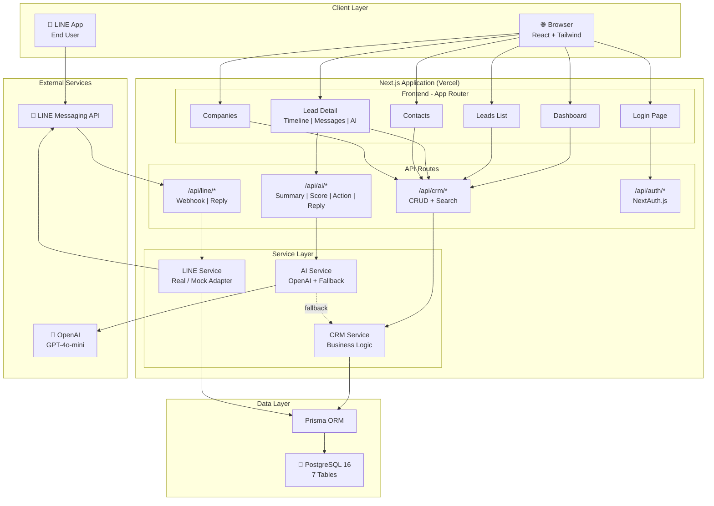
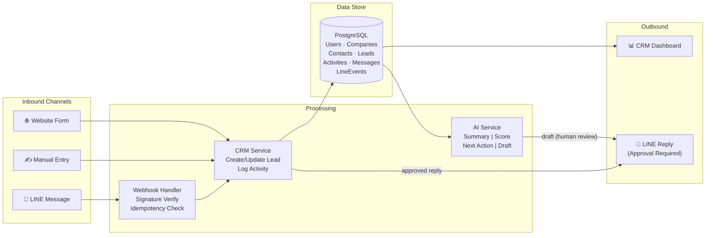
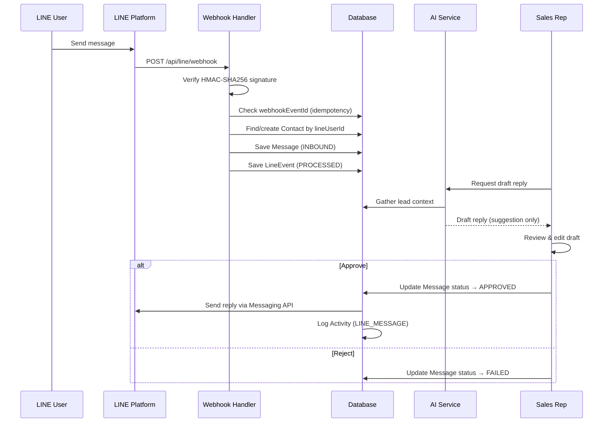

# AI CRM MVP — Jenosize

An AI-powered CRM system for sales teams with LINE OA integration, built as a test assignment for the Lead AI Software Engineer position at Jenosize.

## 📖 Documentation

| Document | Description |
|----------|-------------|
| [🚀 Deployment Guide](docs/DEPLOYMENT.md) | การติดตั้ง, Production deploy, LINE OA, Cloudflare Tunnel |
| [📖 User Manual](docs/USER_MANUAL.md) | คู่มือการใช้งานระบบอย่างละเอียด (ภาษาไทย) |

## 🚀 Quick Start

### Prerequisites
- Node.js 18+
- PostgreSQL database (or Supabase free tier)
- (Optional) OpenAI API key
- (Optional) LINE Official Account

### 1. Clone & Install
```bash
git clone <repository-url>
cd ai-crm-mvp
npm install
```

### 2. Environment Setup
```bash
cp .env.example .env.local
# Edit .env.local with your database URL and API keys
```

### 3. Database Setup
```bash
# Push schema to database
npm run db:push

# Seed with synthetic data
npm run db:seed
```

### 4. Run Development Server
```bash
npm run dev
# Open http://localhost:3000
```

### Credentials removed
| Email | Password | Role |
|-------|----------|------|
| seed-admin@example.invalid | [removed] | Admin |
| seed-sales-1@example.invalid | [removed] | Sales |
| seed-sales-2@example.invalid | [removed] | Sales |
| seed-user@example.invalid | [removed] | Demo |

---

## 🏗 Architecture

### Tech Stack
| Layer | Technology |
|-------|-----------|
| Frontend | Next.js 16 (App Router), React 19, TypeScript |
| Styling | Tailwind CSS v4, Custom dark design system |
| Backend | Express.js + TypeScript (standalone, port 4000) |
| Database | PostgreSQL 16 + Prisma ORM |
| AI | Multi-provider: OpenAI / Gemini Gateway / Heuristic Fallback |
| LINE | LINE Messaging API (Real + Mock adapter) |
| Auth | JWT (stateless, bcrypt password hash) |
| Tunnel | Cloudflare Tunnel (ai-crm / ai-crm-api subdomains) |

### System Architecture



### Data Flow Diagram



### LINE Reply Flow (Human-in-the-Loop)



### Key Design Decisions
1. **Next.js monolith** over separate backend — reduces deployment complexity for MVP
2. **AI suggestions ≠ confirmed actions** — human-in-the-loop for all AI outputs
3. **LINE reply requires approval** — draft → approve → send flow with audit trail
4. **Idempotent webhook processing** — LineEvent table prevents duplicate processing
5. **Graceful AI fallback** — rule-based heuristics when OpenAI is unavailable

---

## 🧪 Testing

```bash
# Run all tests
npm test

# Watch mode
npm run test:watch
```

### Test Coverage
- `tests/crm.test.ts` — Core CRM CRUD, stage transitions, search
- `tests/ai-skill.test.ts` — AI behaviors, fallback when API unavailable
- `tests/line-webhook.test.ts` — Webhook signature verification, idempotency

---

## 🤖 AI CRM Copilot

See [`skills/crm-copilot/SKILL.md`](skills/crm-copilot/SKILL.md) for the full skill definition.

### Features
1. **Lead Summary** — AI-generated overview with key points and sentiment
2. **Qualification Score** — 0-100 score with breakdown reasons
3. **Next Best Action** — Prioritized recommendation with timeline
4. **Draft LINE Reply** — Context-aware message draft requiring approval

### Guardrails
- AI outputs are labeled as suggestions, never auto-executed
- LINE replies require human approval before sending
- Fallback to rule-based logic when OpenAI is unavailable
- All AI actions logged in activity timeline

---

## 💬 LINE OA Integration

### Setup
1. Create a LINE Official Account at https://developers.line.biz
2. Enable Messaging API
3. Set webhook URL: `https://your-domain.com/api/line/webhook`
4. Copy Channel ID, Secret, and Access Token to `.env.local`

### Features
- Webhook signature verification (HMAC-SHA256)
- Inbound message capture and contact mapping
- Approval-based reply flow
- Idempotent event processing (retry-safe)
- Mock adapter for local testing (`LINE_USE_MOCK=true`)

---

## 📦 Deployment

### Vercel + Supabase
```bash
# 1. Create Supabase project (free tier)
# 2. Copy DATABASE_URL from Supabase dashboard

# 3. Deploy to Vercel
npx vercel

# 4. Set environment variables in Vercel dashboard
# 5. Run migrations
npx vercel env pull .env.local
npm run db:push
npm run db:seed
```

---

## 🤖 AI Usage Log

See [`docs/AI_USAGE_LOG.md`](docs/AI_USAGE_LOG.md) for the full log including:
- Sample tasks/prompts given to AI coding assistant
- What was reviewed, modified, and rejected after human inspection
- One meaningful change: AI auto-send → human approval flow

**Key stats**: ~30 AI-assisted tasks, ~40% accepted as-is, ~45% modified, ~15% rejected.

---

## 📊 Monitoring & Observability

### Current Implementation
- **Structured logging** via Pino with child loggers per service (`crm`, `ai`, `line-webhook`)
- **Request-level context**: All API errors logged with stack traces and request metadata
- **LINE event tracking**: Every webhook event persisted with processing status (RECEIVED → PROCESSED/FAILED)
- **AI usage tracking**: All AI calls logged with fallback flag

### Production Recommendations
- **Error tracking**: Sentry for frontend + backend error capture
- **APM**: Datadog or New Relic for request latency, DB query performance
- **Alerting**: PagerDuty/Opsgenie for webhook failure rate > 5%
- **Dashboards**: Grafana for pipeline conversion rates, AI usage metrics
- **Log aggregation**: Ship Pino JSON logs to ELK/Loki

---

## 💬 LINE OA Test Instructions

### Local Testing (Mock Mode)
The CRM runs with `LINE_USE_MOCK=true` by default. The mock adapter:
- Accepts all webhook requests without signature verification
- Logs outbound messages to console instead of sending to LINE
- Returns success responses for all reply operations

### With Real LINE OA Account
1. Create a LINE Official Account at [developers.line.biz](https://developers.line.biz)
2. Enable **Messaging API** in the channel settings
3. Copy credentials to `.env.local`:
   ```
   LINE_CHANNEL_ID=<your-channel-id>
   LINE_CHANNEL_SECRET=<your-channel-secret>
   LINE_CHANNEL_ACCESS_TOKEN=<your-access-token>
   LINE_USE_MOCK=false
   ```
4. Set webhook URL: `https://<your-domain>/api/line/webhook`
5. Enable "Use webhook" in LINE console
6. Scan QR code in LINE console to add the bot as a friend
7. Send a message → it appears in CRM under the mapped contact

---

## 📋 Known Limitations & Production Next Steps

### Known Limitations
- Auth uses credential provider (not suitable for production SSO)
- No real-time updates (polling-based, should add WebSocket/SSE)
- AI rate limiting not enforced at API level
- No file upload for attachments
- No email integration (only LINE and manual)

### Production Improvements
- [ ] Add Supabase Auth or Auth0 for production auth
- [ ] WebSocket/SSE for real-time lead updates
- [ ] Rate limiting middleware for AI endpoints
- [ ] Redis cache for AI responses
- [ ] Audit log for compliance
- [ ] Role-based access control (RBAC)
- [ ] Data export (CSV/Excel)
- [ ] Email integration (SendGrid/SES)
- [ ] Mobile app or PWA
- [ ] CI/CD pipeline with GitHub Actions
- [ ] Monitoring (Sentry, Datadog)
- [ ] Load testing with k6

---

## 📝 License

This is a test assignment project. Not for production use.
